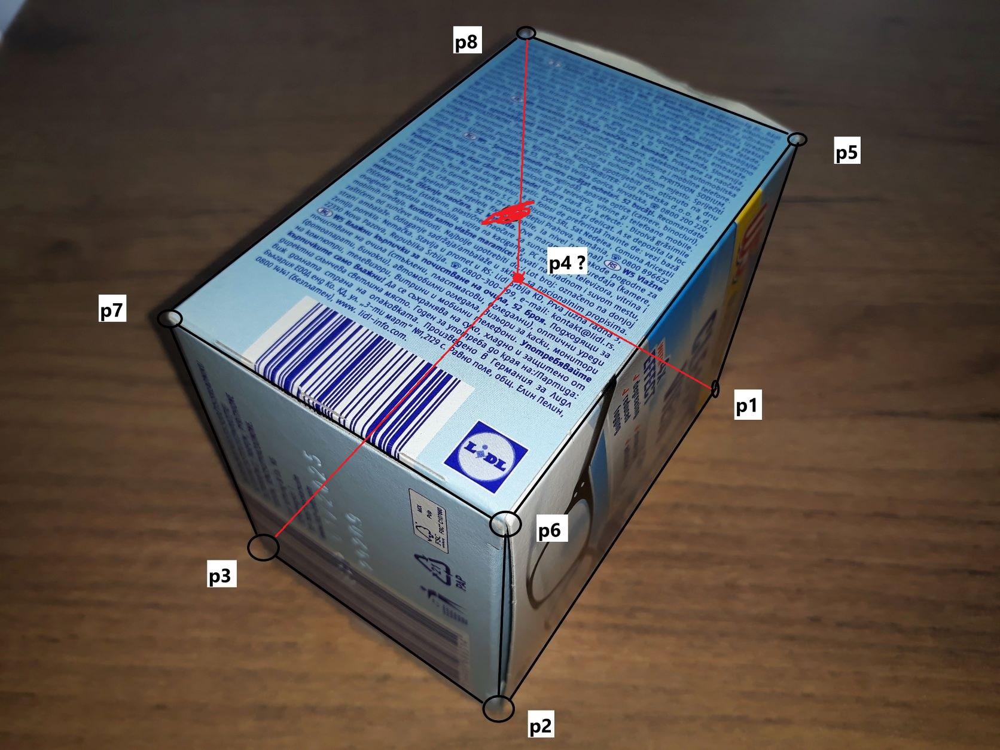

## Find the Invisible Point

Write a script that for given seven visible vertices P1, P2, P3, P5, P6, P7, P8 finds invisible vertex P4.

Kao rezultat domaćeg priložiti:

1. svoju fotografiju nekog kvadra, kutije.... Fotografisati iz blizine kako bi se dobila projektivna distorzija, sa oznakama temena. Na slici treba da bude docrtana i nevidljiva tačka P4. Fotografija treba da bude u  JPG formatu, ne veca od 1200x800 piksela. Fotografija mora biti originalna.

2. skrišot ekrana  na kom se vide piksel koordinate 7 temena, koordinate dobijene tacke i deo koda. Recimo, kao skrinšot iz Mathematica-e u prilogu, samo konciznije.